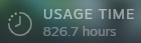
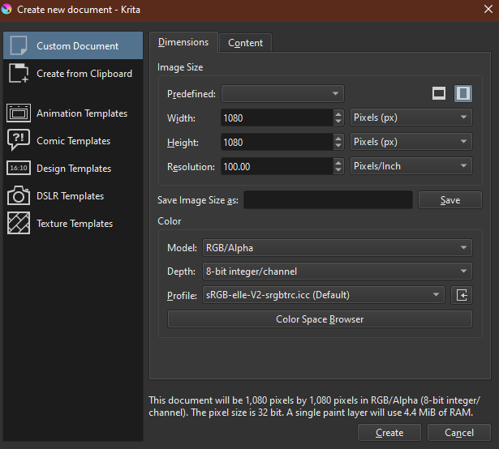
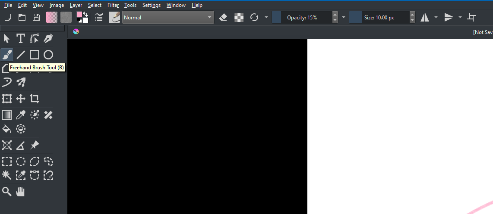
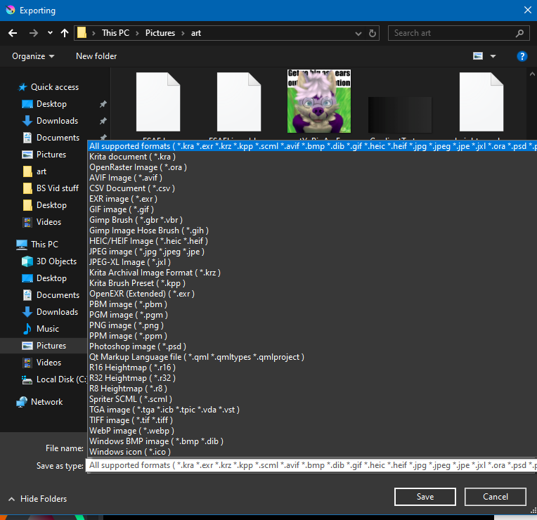

A program that I use very often is called Krita. It is an open source digital art software 
(similar to photoshop) that is known for it's depth and controllability of brushes and image data.
It is probably the most difficult to learn digital art tool available, 

but afterI have grown to love how much I can modify the function of brushes and 
image layers. To the point that I can easily draw dense leaves and luscious fur with a few brush strokes 
in a couple minutes.

But why do so many people find It difficult to pick up? Let's assume you are an aspiring artist wanting to 
draw some digital art. You open the program, you click New Image and then you're hit with this window:

Without prior knowledge about "what is a good resolution" or an understanding of color space, this is an 
immediate roadblock. There are templates, but I have never found them helpful. But lets assume you pick 
a resolution and color space you find appropriate. You then get sent to the main image editor, or whatever 
you want to call it, with the drawing tool immediately selected. You can start drawing now, but you are still 
surrounded by an overwhelming amount of tools. Each tool has little more than a name, not what they do. Every
menu can be dragged and moved anywhere on the screen, which is great for flexibility but an atrocious example of
recognition.

Its at this point where the user is expected to trundle through the help and documentation website at krita.org
for the next few hours and begin practicing using the software. As far as UX solutions go, that is certainly not one.

Finally, to export the image file as a compressed image (such as .png or .jpeg) you click export, and then using the 
standard OS file navigator, you select the file type you want to export the image as. 

Once again, atrocious example of "Recognition instead of Recall", but also doesn't share the design language of the rest 
of the rest of the program. Additionally, there's a good chance the user won't notice the filetype options at the bottom
and hit another roadblock.

