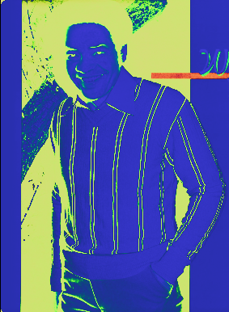

A program that I use very often is called Krita. It is an open source digital art software 
(similar to photoshop) that is known for it's depth and controllability of brushes and image data.
It is probably the most difficult to learn digital art tool available, 

but afterI have grown to love how much I can modify the function of brushes and 
image layers. To the point that I can easily draw dense leaves and luscious fur with a few brush strokes 
in a couple minutes.

But why do so many people find It difficult to pick up?

One of the first things about all digital art is the tools necessary to use it. You can't just use a 
computer mouse and expect it to be just as good as a pen and paper.(unless you are just that good) You need 
a tablet of some kind. These can be as basic as large trackpads controlled by a digital pen, and as complex as
4k monitors with high resolution pen touch sensitivity, pen angle, and lift. Even then many artists prefer 
traditional methods such as oil painting etc. because of the physicality of it all.

The next thing is how broad Krita can be used. When you open up a new image you immediately get smaked in the face with 
a few dozen options to modify how the image data is handled. Most of which you wouldn't understand unless you 
studied computer science  Additionally, Krita also has the most dynamic
brush editor I have ever seen, and hundreds of image layer blending options that are popularly used in photography,
cinematography, animation, painting, Photoshop blending methods, binary operations, and quadratic equations. 
For example: here's an image of Bill Withers converted to a normal map: 

These issues are issues because they require the user to have prior knowledge or experience about image processing 
to use it effectively. Krita tries to mitigate this issue by having a very detailed wiki for the software that is 
incorporated into the program itself, but now a beginner artist needs to read a few hours of documentation. So.. not 
the best solution.
